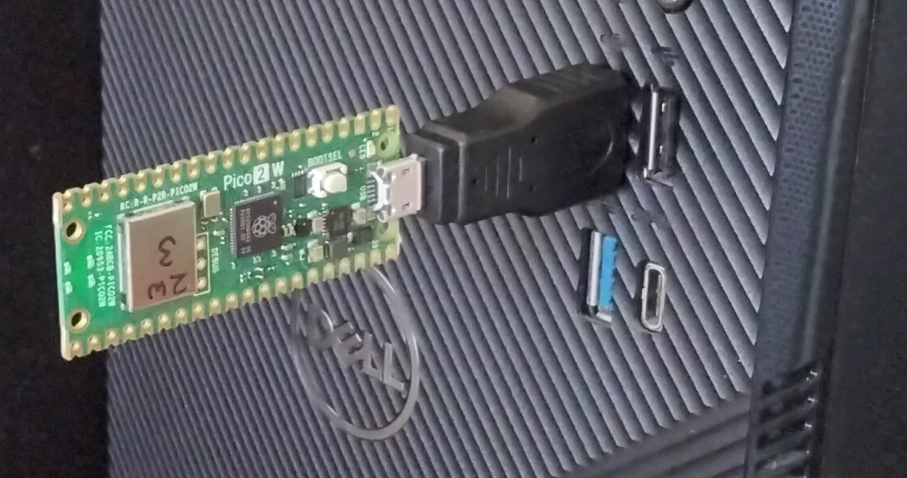

Pi Dongle for Windows
==========================

*Version 25*

## Contents
- [1 Introduction](#1-introduction)
    - [1.1 File list](#1-1-file-list)
- [2 Dongles](#2-dongles)
    - [2.1 Pico dongle](#2-1-pico-dongle)
        - [2.1.1 Hardware](#2-1-1-hardware)      
        - [2.1.2 Visual Studio Code Procedure](#2-1-2-visual-studio-code-procedure) 
        - [2.1.3 Pi SDK Procedure](#2-1-3-pi-sdk-procedure)         
        - [2.1.4 Compile problems](#2-1-4-compile-problems)             
    - [2.2 Pi Zero dongle](#2-2-pi-zero-dongle)
        - [2.2.1 Hardware](#2-2-1-hardware)      
        - [2.2.2 Connections](#2-2-2-connections)
        - [2.2.3 Procedure](#2-2-3-procedure)
- [3 Your code](#3-your-code)
    - [3.1 Command line C programs](#3-1-command-line-c-programs)
    - [3.2 Command line Python programs](#3-2-command-line-python-programs)
    - [3.3 Windows GUI program](#3-3-windows-gui-program)
        - [3.3.1 File list](#3-3-1-file-list)
        - [3.3.2 Procedure](#3-3-2-procedure)
        - [3.3.3 Manual procedure](#3-3-3-manual-procedure)        
        - [3.3.4 Where to put your code](#3-3-4-where-to-put-your-code)    
        - [3.3.5 Screen prints](#3-3-5-screen-prints)
        - [3.3.6 Input functions](#3-3-6-input-functions)
          

## 1 Introduction

The btlib library, btferret and any Python or C code written for Linux can be run from a Windows PC by using a
Raspberry Pi Pico 2W or Zero 2W as a Bluetooth dongle for the PC. (The Pico is easier to set up and
makes more sense as a dongle). The PC then has direct access to Bluetooth at the HCI level, which is
not possible with the on-board Bluetooth. It might seem crazy that a dongle is necessary, but
Windows needs a kernel-mode driver to get at the on-board Bluetooth, and that is vastly more
complcated than a dongle.

There are instructions for setting up a Pico dongle in [section 2.1](#2-1-pico-dongle). Python or C btferret code can
then be run from the command line in the same way as with Linux. The C code compile instructions are in
[section 3.1](#3-1-command-line-c-programs), and the Python module compile instructions are in
[section 3.2](#3-2-command-line-python-programs).
There is also a Windows GUI program (shown below)
that is compiled with Visual Studio (instructions in [section 3.3](#3-3-windows-gui-program)).
It includes the Linux btferret.c and has empty functions (in mycode.c) into
which you can insert your own code. Linux code can be simply pasted into
mycode.c, with minor changes for input and output described in section 3.3,
and no knowledge of Windows programming is needed. Linux inputs can be replaced with simple
functions that pop up a dialog window.

To confirm, there are three ways to run btferret code under Windows:

1. C code from the command line
2. Python code from the command line
3. C code inside a Windows GUI program


A Pico dongle.



Windows GUI screen.


## 1-1 File list


```
In the github/windows folder

For the Pi Pico dongle
  btfpico.c
  CMakeLists.txt
  btstack_config.h (but we hope we don't need this file)

For the PiZero dongle
  btfdongle.c

For Command line C programs
  btlibw.c
  btlib.h
  btfcmdline.c
  devices.txt
          
For Command line Python programs
  btlibw.c
  btlib.h
  btfcmdline.c
  btfpython.c
  btfwinpymake.py
  devices.txt
        
For Windows GUI program
  BTferret.sin
  BTferret.vcxproj
  BTferret.vcxproj.filters
  btlibw.c
  btfw.c
  mycode.c
  btferretw.c
  btlib.h  
  btfw.rc
  devices.txt

NOTE in case you modify btferret/btlib for Linux and Windows
  btlibw.c is the Linux btlib.c with #define BTFWINDOWS uncommented
  btferretw.c is the Linux btferret.c with #define BTFWINDOWS uncommented
```

## 2 Dongles


## 2-1 Pico dongle

These instructions are for a Pico 2W, but a Pico W will also work. The code can be
compiled with Visual Studio Code, or the Pi SDK. The btlib functions
running on the Windows PC replace the Pico's btstack.

### 2-1-1 Hardware

The follwing items are needed:

```
1. Raspberry Pi Pico 2W
2. Micro USB to Male USB A cable or adapter
```

### 2-1-2 Visual Studio Code Procedure

This procedure uses Visual Studio Code on a PC to compile and download code to the Pico 2W. Here are full
instructions if using VSC for the first time. There may be long delays at various stages as stuff is
downloaded.

```
1. Create a folder called "btfpico" in a location that you choose.
2. Copy two files to the btfpico folder:
       btfpico.c
       CMakeLists.txt
3. If the board is not a Pico 2W, edit the CMakeLists.txt line:
        set(PICO_BOARD pico2_w)
4. Download Visual Studio Code.
5. Start Visual Studio Code. 
6. Select View/Extensions. Search for Raspberry Pi Pico. Install extension.
7. Click the Pico icon (probably in the vertical section on the
   left of the screen). It looks like a chip and reports
   "Raspberry Pi Pico Project" when the mouse is hovered over it.
8. Select "Import project" and set:
       Location = Your btfpico folder 
9. At the bottom right of the screen, check that the board is
   correct. If not, it can be changed by clicking on Board:
       Board = pico 2w
       Use RISC V = no
10. From the bottom of the screen, click Compile. If it fails, see
    Compile problems.
11. Plug the Pico into the PC while pressing the BOOTSEL button. A new
    disk drive called something like "RP2350" should appear on the PC.          
12. From the bottom of the screen, click Run. If Run does not work,
    you can do it yourself with Explorer. Just copy the executable
    file (btfpico/build/btfpico.uf2) to the disk.       
13. The LED on the Pico should flash briefly which shows that the code
    is running.
14. The dongle is waiting to be connected by the PC Windows program
    and appears to the PC as a COM port. Check on the PC via:
    right click Start/Device manager/Ports (COM & LPT) which should
    list the dongle as a USB Serial Device (COM port).
    Note the COM number, but it may change every time the PC is started.
15. When the PC is restarted, the dongle will run the code.
16. Run the BTferret Windows program to connect and control the dongle.
``` 

### 2-1-3 Pi SDK Procedure

This procedure uses the Pico SDK on a Pi. It includes instructions to install the SDK from scratch.
If the SDK is already installed, start at step 8.

Install Pico SDK. Download pico_setup.sh from one of the following:

[Setup1](https://raw.githubusercontent.com/raspberrypi/pico-setup/master/pico_setup.sh)
or
[Setup2](https://github.com/raspberrypi/pico-setup/blob/master/pico_setup.sh)

```
1. Make a pico directory
      cd /home
      mkdir pico
      cd pico
2. Copy pico_setup.sh to /home/pico/
3. Edit pico_setup.sh to set the directory
      Change OUTDIR="$(pwd)/pico"
      To     OUTDIR="/home/pico"
4. Make pico_setup.sh executable
      sudo chmod 777 pico_setup.sh
5. Run to install SDK (takes a long time)
      cd /home/pico
      ./pico_setup.sh
6. Set environment variable
      export PICO_SDK_PATH=/home/pico/pico-sdk
7. Reboot
      sudo reboot      
8. Make a btfpico directory
      cd /home/pico
      mkdir btfpico
9. Copy the following files to /home/pico/btfpico/
      btfpico.c              (from GITHUB btferret/windows)
      CMakeLists.txt         (from GITHUB btferret/windows)
      pico_sdk_import.cmake  (from /home/pico/pico-examples/)
10. If the board is not a Pico 2W, edit the CMakeLists.txt line:
       set(PICO_BOARD pico2_w)      
11. Make a build directory in the btfpico directory.
      cd /home/pico/btfpico
      mkdir build
12. Go to build directory
      cd /home/pico/btfpico/build
13. Run cmake (NOTE space between cmake and dots)
      cmake ..
14. Compile
      make
15. This should create the executable file in the build directory:
      btfpico.uf2
16. Plug Pico into Pi while pressing BOOTSEL button.
17. Check Pico is present as a disk
       picotool info
18. Load btfpico.uf2 to Pico (just copies the file to the Pico "disk")
       picotool load btfpico.uf2
19. If btfpico.c is modified, re-compile with make
       cd /home/pico/btfpico/build
       make
20. Plug the Pico into a PC and run the BTferret Windows code.
```

### 2-1-4 Compile problems

If the board type is not correct, compile can fail with missing include files.

```
In CMakeLists.txt:

set(PICO_BOARD pico2_w)
```

The btfpico.c and CMakeLists.txt files are set up to compile without btstack.
If some future version of the Pico libraries causes this to fail, 
then modifications can be made to include btstack as follows:

```
1. In btfpico.c, uncomment USE_BTSTACK:

   #define USE_BTSTACK

2. In CMakeLists.txt, uncomment the following instructions:

   add_compile_definitions(CYW43_DISABLE_BT_INIT=1)
   target_link_libraries(blink pico_btstack_cyw43)
   target_link_libraries(blink pico_btstack_ble)
   target_include_directories(blink PRIVATE ${CMAKE_CURRENT_LIST_DIR})

3. Add btstack_config.h to the btfpico folder
```

Now btstack is linked but not initialized. So it isn't used, but the compiler can see it,


## 2-2 Pi Zero dongle

These instructions also work for a Pi4, but you must be sure that the PC can supply enough
current via its USB port.

### 2-2-1 Hardware

The follwing items are needed:

```
1. Raspberry Pi Zero 2W
2. Micro SD card
3. Mini HDMI to HDMI cable
4. OTG cable (Micro USB to female USB A)
5. Micro USB to Male USB A cable
6. Power supply with Micro USB plug
```

### 2-2-2 Connections


A Pi Zero needs one set of connections to set up the dongle, and then a different arrangement for
normal use. A Pi4 can use a single setup for both functions. If fitted, the optional switch will halt
and power down on a first press, and reboot on a second.


### 2-2-3 Procedure

This procedure uses a PC to download the Pi operating system and btfdongle.c to
an SD card for the PiZero2W, and then modify the PiZero2W configuration to operate as a Bluetooth dongle.

1) Download the following file from github/windows to the PC. 

```
btfdongle.c
```

2) On the PC, download OS to an SD card. Raspberry Pi OS Lite 64 bit
(NOTE Lite, NOT desktop versions) from:

www.raspberrypi.com/software/

```
Download for Windows
Click on downloaded imager exe file to install and run
  Device = Raspberry Pi Zero 2W
  Operating system = Raspberry Pi OS (other) - Raspberry Pi OS Lite (64-bit)
  Storage = SD card
  Edit settings = No
```

3) Before removing the SD card from the PC, copy btfdongle.c to the SD card top level folder
(not the overlays folder).
The SD card might have been ejected, so re-insert it, copy the file, and eject.

4) Insert SD card in Pi Zero in setup configuration and turn on. Because there is no mouse,
use the tab key to move the focus between options on the setup screens, Set user name = pi which will
create a /home/pi/ folder, then login to pi.

```
Please enter new username:
pi
```

Enter a password twice (wait for long delay after second).

```
login: pi
```


5) Set up a root account by choosing a root password.

```
sudo passwd
```

6) Switch to root so you have permission for the actions that follow. 

```
su root
```

7) Move /boot/firmware/btfdongle.c to /home/pi/

```
cd /boot/firmware
mv btfdongle.c /home/pi/
```

8) In /home/pi/ compile btfdongle.c:

```
cd /home/pi
gcc btfdongle.c -o btfdongle
```

9) Run btfdongle to check that it is working OK:

```
./btfdongle
```

It should report "COM open fail" and exit because it is not set up as a dongle yet, but it does
show that it runs correctly.
          
10) Disable wifi and enable USB serial service by editing config.txt. The gpio-shutdown is for
the optional halt/boot switch.

```
nano /boot/firmware/config.txt

IN nano editor add after [all]

[all]
dtoverlay=dwc2
dtoverlay=disable-wifi
dtoverlay=gpio-shutdown


CTL-X to exit nano and save file
```

11) Enable USB serial service by editing cmdline.txt

```
nano /boot/firmware/cmdline.txt

IN nano DELETE console=serial0,115200
        ADD    modules-load=g_serial   to the end of the single line

EXISTING
console=serial0,115200 console=tty1  ....  rootwait

CHANGE TO
console=tty1 ... rootwait modules-load=g_serial

```

12) Enable headless boot to root by editing getty service.

```
nano /lib/systemd/system/getty@.service

IN nano editor change the [Service] ExecStart line by
inserting -a root in place of the existing entry

EXISTING might be
ExecStart=-/sbin/agetty -o '-p --\\u' --noclear -$TERM

CHANGE TO
ExecStart=-/sbin/agetty -a root --noclear -$TERM

```

When started, the device will boot up in root without prompting for a user name or password, so
can be used headless.

13) Enable auto start btfdongle on boot by editing bashrc

```
nano /root/.bashrc

IN nano add the following at the bottom

cd /home/pi
./btfdongle

```

14) Check that this all works by rebooting

```
reboot
```

Without any user input it should login as root, run btfdongle, and report "COM open" and "Bluetooth OK".
CTL-C to exit btfdongle.


15) Halt Pi Zero.

```
halt
```

Reconfigure the connections to the dongle configuration. The monitor can be left
connected to the PiZero to check what happens. Plug into PC. It should boot up, start btfdongle,
and report "COM open/Bluetooth OK". It is now waiting for commands from BTferret
running on the PC. Check on the PC via: right click Start/Device manager/Ports (COM & LPT) which should list
the dongle as a USB Serial Device (COM port). Note the COM number, but it may change every time the PC is started.


## 3 Your code 

## 3-1 Command line C programs

The Microsoft C/C++ SDK must be installed, preferably with Visual Studio.

```
DOWNLOAD from the github windows folder 
  btlibw.c
  btlib.h
  btfcmdline.c
  devices.txt
```

```
In the Windows search box type:
  developer command prompt
  
Click on the result to pop up a command prompt window with the
correct environment for C compilation.

COMPILE your program from the command line:

cl /D_CRT_SECURE_NO_WARNINGS  yourcode.c btfcmdline.c btlibw.c

Then run yourcode

The Linux btferret.c can be compiled as follows

cl /D_CRT_SECURE_NO_WARNINGS  btferret.c btfcmdline.c btlibw.c
```

The only change to Linux C programs is to specify the dongle's COM port number
in the Bluetooth initialisation. It can be done in three ways: prompt, auto search,
or specify the number.

```
init_blue("C:\\rat\\devices.txt");      // Will prompt for COM port number
   or use the _ex version
init_blue_ex("C:\\rat\\devices.txt",7)  // Dongle is on COM7
init_blue_ex("C:\\rat\\devices.txt",DONGLE_COM_PROMPT);  // Prompt for COM port
init_blue_ex("C:\\rat\\devices.txt",DONGLE_COM_AUTO);    // Searches for COM port
```

The DONGLE\_COM\_AUTO search option tries to open all COM ports from COM1 to COM20.
It then sends ping data, and if it receives the correct response, it uses that port.
So beware if there are lower-numbered COM ports that would be affected by this.
If you want to re-write the search procedure, it is in the inithci() function near
the top of btfcmdline.c.


## 3-2 Command line Python programs

The Microsoft C/C++ SDK must be installed, preferably with Visual Studio.

```
DOWNLOAD from the github windows folder 
  btlibw.c
  btlib.h
  btfcmdline.c
  btfpython.c
  btfwinpymake.py
  devices.txt
```

The Python btfpy library module must be built first.

```
RUN from the command line
(NOTE do not use the developer command prompt that was needed for C)

python btfwinpymake.py build

This should compile the module. It will create a subdirectory called build
containing a subdirectory called somthing like lib.win-amd64-cpython-312.
This will contain the module called something like btfpy.cp312-win-amd64.pyd.
Copy this to your code directory and rename it btfpy.pyd so the import btfpy
instruction can find it.

build
  lib.win-amd-cpython-312
    btfpy.cp312-win-amd64.pyd   RENAME this btfpy.pyd and copy
                                to where your code can find it

Then run any Linux Python code, for example:

python btferret.py
```

The only change to Linux Python programs is to specify the dongle's COM port number
in the Bluetooth initialisation. It can be done in three ways. It can be done
in three ways: prompt, auto search, or specify the number.

```
btfpy.Init_blue("C:\\rat\\devices.txt");      // Will prompt for COM port number
   or use the _ex version
btfpy.Init_blue_ex("C:\\rat\\devices.txt",7)  // Dongle is on COM7
btfpy.Init_blue_ex("C:\\rat\\devices.txt",btfpy.DONGLE_COM_PROMPT);  // Prompt for COM port
btfpy.Init_blue_ex("C:\\rat\\devices.txt",btfpy.DONGLE_COM_AUTO);    // Searches for COM port
```
The DONGLE\_COM\_AUTO search option tries to open all COM ports from COM1 to COM20.
It then sends ping data, and if it receives the correct response, it uses that port.
So beware if there are lower-numbered COM ports that would be affected by this.
If you want to re-write the search procedure, it is in the inithci() function near
the top of btfcmdline.c.

## 3-3 Windows GUI program

### 3-3-1 File list

DOWNLOAD from the github windows folder - see Procedure section for destination locations.

```
BTferret.sin
BTferret.vcxproj
BTferret.vcxproj.filters
btfw.c
btferretw.c
btlibw.c
mycode.c
btfw.rc
btlib.h
devices.txt

NOTE - if you intend to modify the Linux btferret.c or btlib.c
       and use it for Windows
  btferretw.c  is the Linux btferret.c with #define BTFWINDOWS uncommented
  btlibw.c  is the Linux btlib.c with #define BTFWINDOWS uncommented  
```

### 3-3-2 Procedure

These are instructions for compiling the Windows program BTferret using Visual Studio.

1) Create a folder called BTferret to hold the project. Visual Studio would put it at
the following location where xxxx is your user name, but you can put the BTferret folder anywhere.

```
C:\Users\xxxx\source\repos\BTferret
```

2) Copy the following files to the BTferret folder.

```
BTferret.sin
BTferret.vcxproj
BTferret.vcxproj.filters
btferretw.c
btfw.c
btfw.rc
btlib.h  
btlibw.c
mycode.c
```

3) Copy devices.txt to a working folder that you choose. When BTferret starts it will
prompt for the location of this devices file. Initially it will assume that it is in
your Documents folder, but you can put it anywhere.

```
Copy devices.txt to for example

C:\Users\xxxx\Documents\devices.txt

```

4) Start Visual Studio. Select "Open a project or solution", and select BTferret.sin in your project
folder. (NOTE - Visual Studio, NOT Visual Studio Code).

5) When the project has loaded select Build/Build solution. It should report: "Build: 1 succeeded..".
If it fails see the Mauual Procedure section below.

6) With the dongle in place, run via Debug/Start without debugging.
 
7) Select Dongle/Auto open. If it reports "Bluetooth OK" then BTferret.exe is working and communicating
with the dongle. Select Run/BTferret to run btferret which will prompt for the location of devices.txt,
or Run/Mycode 1 to demonstrate Windows input funtions. A shortcut can be created from the exe file
(by right clicking it in Explorer and drag the shortcut to the desktop): 

```
Location

C:\.....\BTferret\Release\BTferret.exe
```


### 3-3-3 Manual Procedure

The instructions above should work by reading the project settings from the BTferret.sin/vcxpoj files.
If not, this more difficult procedure builds the project and settings from scratch.

1) Start Visual Studio. Select "Create a new project".

2) Select "Empty Project".

3) On project setup screen.

```
Project Name = BTferret
Location (leave unchanged) = C:\Users\xxxx\source\repos\BTferret\  (xxxx is your user name)
Tick "Place solution and project in same directory"
```
4) Click Create and an empty project will be created.

5) File/Save BTferret and exit Visual Studio.

6) Copy the following files to the BTferret folder.

```
btlib.h 
btfw.c
btferretw.c
btlibw.c
mycode.c
btfw.rc
```

7) Copy devices.txt to a working folder that you choose. When BTferret starts it will
prompt for the location of this devices file. Initially it will assume that it is in
your Documents folder, but you can put it anywhere.

```
Copy devices.txt to for example

C:\Users\xxxx\Documents\devices.txt

```

8) Restart Visual Studio and select BTferret

9) Select Project/Add existing item to add the following files:

```
btlib.h
btfw.c
btferretw.c
btlibw.c
mycode.c
btfw.rc
```

10) The configuration must be Release/x86/WIN32.

```
Select Build/Configuration manager
   Active solution configuration = Release
   Active solution platforms = x86
   Project contexts = BTferret  Release  Win32  Tick Build  Untick Deploy
```


11) Various other settings:

```
Select Project/Properties - All configurations / Platform = WIN32
    
    Advanced
        Character set = Use Multi Byte Character Set
    C/C++
        Preprocessor
          Preprocessor Definition - select <edit> and add _CRT_SECURE_NO_WARNINGS
          so the edit window appears as follows: 
             WIN32
             _CRT_SECURE_NO_WARNINGS
             <different options>
    Linker
        System
          Subsystem = Windows(/SUBSYSTEM:WINDOWS)

```


12) Compile with Build/Build solution. It should report: "Build: 1 succeeded..".

13) With the dongle in place, run via Debug/Start without debugging.
 
14) Select Dongle/Auto open. If it reports "Bluetooth OK" then BTferret.exe is working and communicating
with the dongle. Select Run/BTferret to run btferret which will prompt for the location of devices.txt,
or Run/Mycode 1 to demonstrate Windows input funtions. A shortcut can be created from the exe file: 

```
Location

C:\Users\xxxx\source\repos\BTferret\Release\BTferret.exe
```
     

### 3-3-4 Where to put your code

Code written for Linux can be simply pasted into mycode.c with some minor changes for input and
output functions. No Windows programming knowledge is needed. Simple Windows screen print
and input functions are available from the btlib library as described below.

Your code goes into mycode.c. There are ten functions that are called from the Run menu: mycode1(),
mycode2(),.... mycode10(). Mycode1 is programmed to demonstrate the Windows input/output
functions. Insert your code into one of these functions as below.

*** NOTE ***: Windows file names must use double backslash.

```
int mycode2()
  {  
  if(init_blue("C:\\Users\\myname\\Documents\\btferret\\devices.txt") == 0)
    return(0);
    
  // your code here  
    
  close_all();
  }
```
         

### 3-3-5 Screen prints

The C printf function will not work with Windows. The btlib library provides a print function. 
Use it as follows:

```
LINUX
 
  printf("Hello\n");
  printf("Result = %d\n",retval);
  
  
WINDOWS GUI

  char buf[32];
  
  print("Hello\n");
  sprintf(buf,"Result = %d\n",retval);
  print(buf);
```

To make code fully portable, an equivalent print function could be
added to Linux code.

```
void print(char *s)
  {
  printf("%s",s);
  }
```

If you want to save the screen output to a file, use Edit/Save As which does the same thing as
the btlib output_file() function.

### 3-3-6 Input functions

The following functions are available from the btlib library. The Mycode1 function in mycode.c demonstates
all these functions. Documentation in the main btferret README.

```
These functions pop up a dialog window

input_integer - Input an integer
input_string - Input a string
input_filename - Input a file name, with a BROWSE button
input_select - Select an item from a drop-down list.
input_radio - Select one option from a radio button list
```


